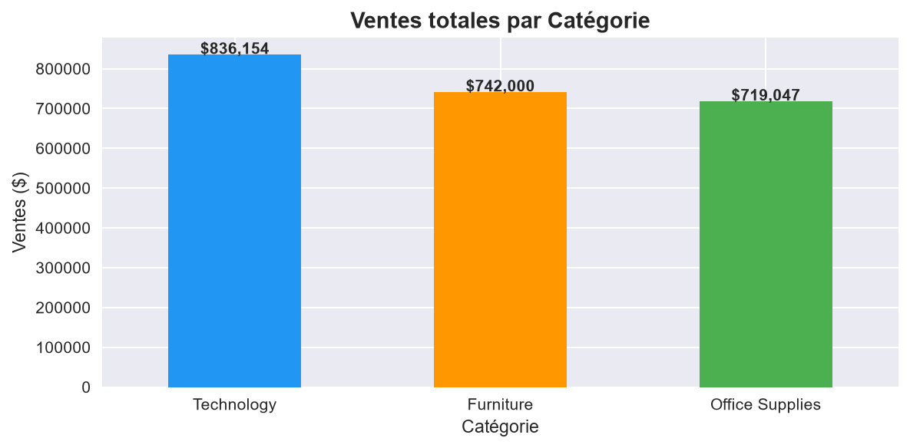
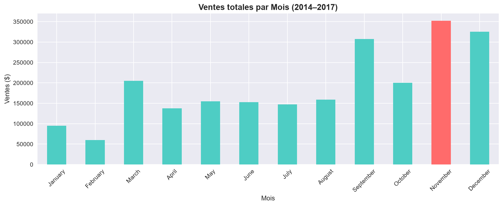
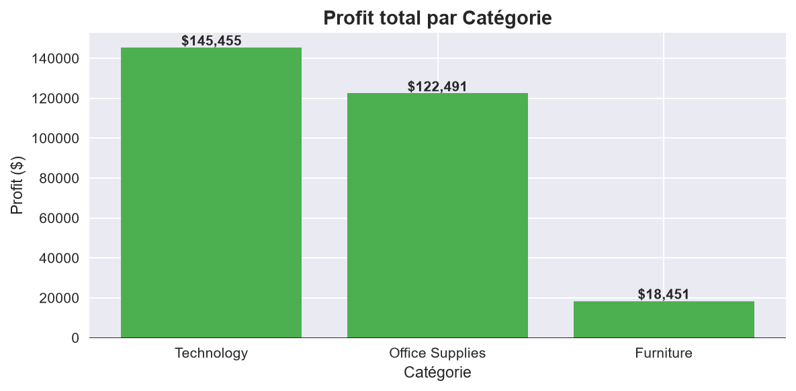
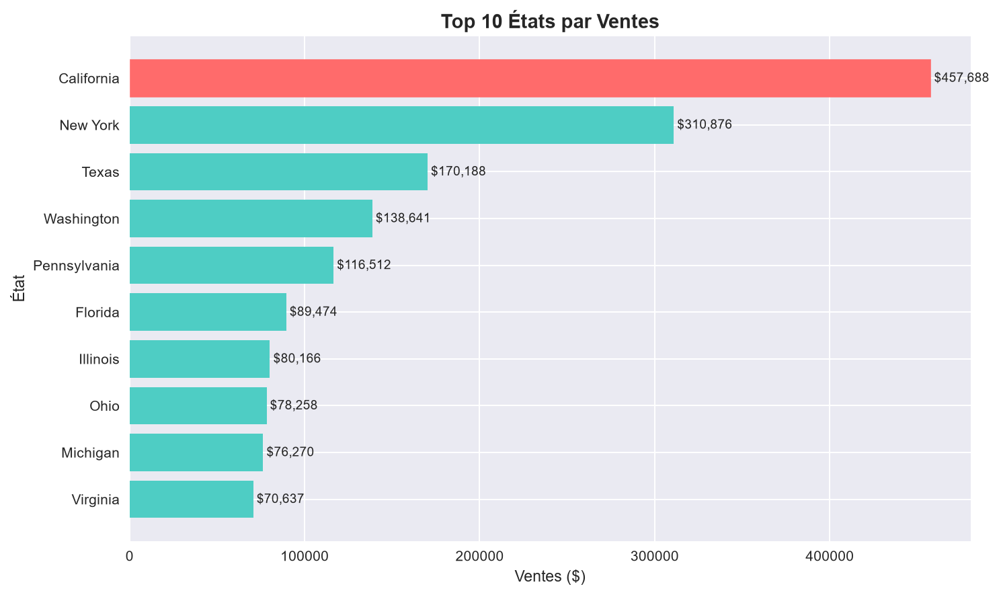
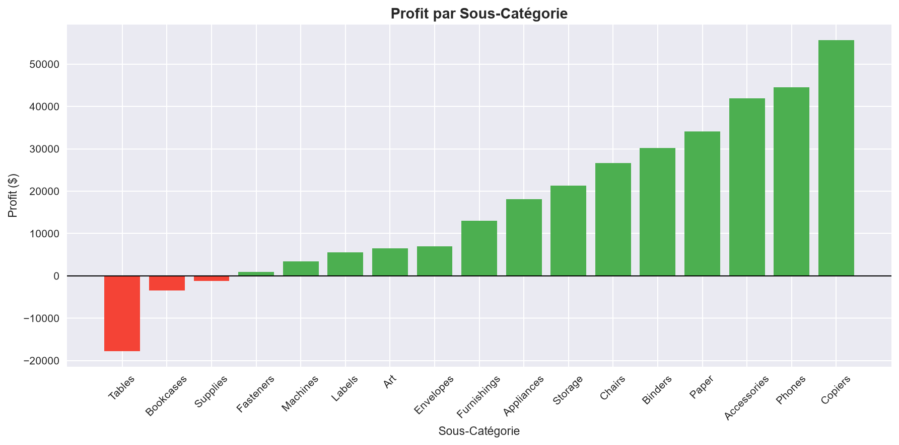

# Day 01 - Sales Analysis

## Goal
Analyze the Sample - Superstore dataset to understand sales performance, profitability, seasonality, and geographic trends.

## Dataset
- **Source:** Kaggle - Superstore Dataset
- **Link:** [Kaggle dataset page](https://www.kaggle.com/datasets/vivek468/superstore-dataset-final)

## Skills Practiced
- Data loading and inspection with pandas
- Data cleaning and date feature engineering
- Aggregation and exploratory data analysis
- Visualization with matplotlib and seaborn

## Steps
1. Load the Superstore dataset and inspect its structure.
2. Clean the data, convert order dates, and create time-based features.
3. Analyze sales and profit by category, month, state, and sub-category.
4. Save the charts in the images folder.

## Key Findings
- Technology leads total sales.
- Sales peak in Q4, with November as the strongest month.
- Furniture generates much lower profit relative to its sales.
- California is the top state by sales.
- Tables and a few other sub-categories are loss-making.

## Tools & Libraries
- Python
- pandas
- matplotlib
- seaborn
- Jupyter Notebook

## How to Run
Open the notebook in VS Code or launch it with Jupyter from the day-01-sales-analysis folder:

```bash
jupyter notebook notebook.ipynb
```

## Screenshots
The notebook saves the charts in the images folder after execution:










